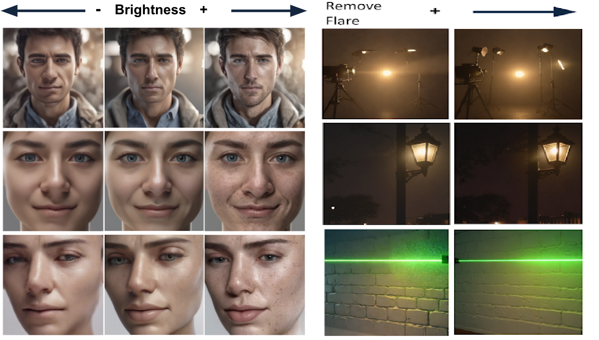

# Controlling Lighting with LoRA Adaptors
### Computer Vision 2 project: Group 3 
| Nimi Barazani | Martijn van Raaphorst | Lars de Wolf | Simon Hüsgen | Yigit Özkaya | Loong Li |


<div align='center'>

</div>

This repository builds upon the work on Concept Sliders by Rohit Gandikota et al, for a project in Computer Vision 2 course at the University of Amsterdam. Our focus is on enhancing the capability of these sliders specifically for controlling lighting attributes in images generated by the diffusion model. We experiment with the method to precisely control lighting conditions, such as light source direction and lens flare correction, using Low-rank Adaptors (LoRA).


## Setup
To set up your python environment:
```
conda create -n sliders python=3.9
conda activate sliders

git  clone https://github.com/LarsdeWolf/CV2-Sliders.git
cd sliders
pip install -r requirements.txt
```

## Gradio Demo
We present our trained concept sliders in a demo using Gradio, which can be runned locally, or using Google Colab. To run our demo locally, ensure the requirements are installed and simply execute DEMO/GradioDemo.py. To use our Colab demo, execute the cells in DEMO/LoraSliderColabDemo.ipynb. 
Both versions use SDXL-Turbo as base model, ensuring high quality image generation at significantly lower inference steps compared to SDXL.     


## Textual Concept Sliders
### Training SD-1.x and SD-2.x LoRa
To train an age slider - go to `train-scripts/textsliders/data/prompts.yaml` and edit the `target=person` and `positive=old person` and `unconditional=young person` (opposite of positive) and `neutral=person` and `action=enhance` with `guidance=4`. <br>
If you do not want your edit to be targetted to person replace it with any target you want (eg. dog) or if you need it global replace `person` with `""`  <br>
Finally, run the command:
```
python trainscripts/textsliders/train_lora.py --attributes 'male, female' --name 'ageslider' --rank 4 --alpha 1 --config_file 'trainscripts/textsliders/data/config.yaml'
```

`--attributes` argument is used to disentangle concepts from the slider. For instance age slider makes all old people male (so instead add the `"female, male"` attributes to allow disentanglement)


### Training SD-XL
To train a lighting slider, you need to modify the configuration file to specify the target and the lighting conditions. For example, to train a light direction slider:
1. Edit the configuration file `train-scripts/textsliders/data/prompts.yaml`:
```
target: "person"
positive: "person with light from the right"
unconditional: "person with light from the left"
neutral: "person"
```
2. Run the training script:
```
python trainscripts/textsliders/train_lora_xl.py --attributes 'male, female' --name 'light_direction_slider' --rank 4 --alpha 1 --config_file 'trainscripts/textsliders/data/config-xl.yaml'
```

## Visual Concept Sliders

### Training SD-XL
For image-based sliders, prepare a dataset of image pairs showing the desired lighting effects. For example, save the images separately based on the lighting intensity and direction as follows:

1. Create and organize your dataset: 
* Download the Multi-PIE lightweight version from [here](https://drive.google.com/file/d/1QxNCh6vfNSZkod1Rg_zHLI1FM8WyXix4/view), and place it in the `dataset` folder.
* To restructure the dataset based on lighting direction and filtering images with only cetered pose, run `dataset/multipie_bright_sorting.py`
* Save images with lighting from the right in a folder named `light_right`.
* Save images with lighting from the left in a folder named `light_left`.

2. Edit the configuration file `train-scripts/imagesliders/data/config.yaml`:
```
target: "light"
positive: "light from the right"
unconditional: "light from the left"
neutral: "light"
```

3. Run the training script:
```
python trainscripts/imagesliders/train_lora_scale_xl.py --name 'light_slider_XL' --rank 4 --alpha 1 --config_file 'trainscripts/imagesliders/data/config-xl.yaml' --folder_main 'datasets/lighting/' --folders 'light_right, light_left' --scales '1, -1'
```

## Citing the original work
The preprint can be cited as follows
```
@article{gandikota2023sliders,
  title={Concept Sliders: LoRA Adaptors for Precise Control in Diffusion Models},
  author={Rohit Gandikota and Joanna Materzy\'nska and Tingrui Zhou and Antonio Torralba and David Bau},
  journal={arXiv preprint arXiv:2311.12092},
  year={2023}
}
```

